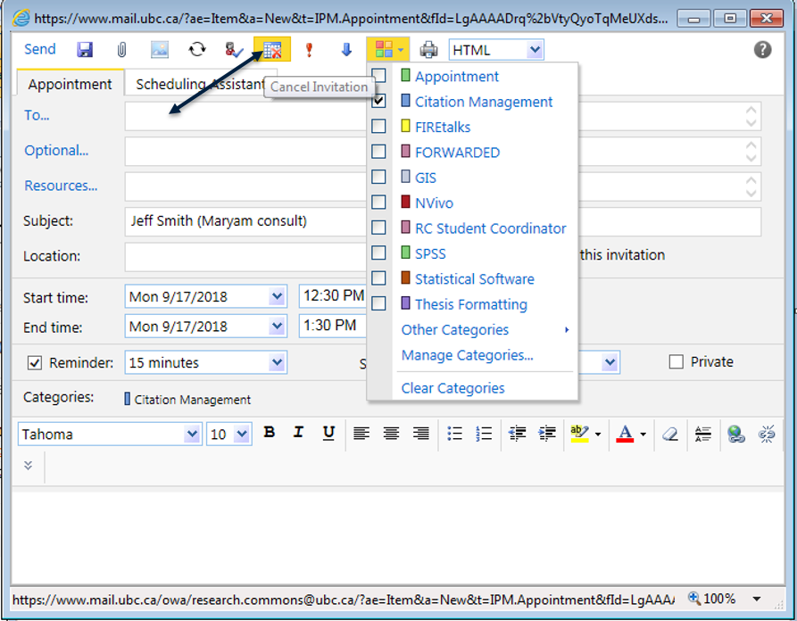
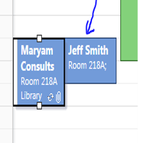

# research.commons@ubc.ca calendar

## Accessing the Research Commons Email Inbox
1. Access the calendar from the same place as the inbox. See [research.commons@ubc.ca inbox](#research.commons@ubc.ca-inbox). 

## Scheduling one-on-one consults
- Don't forget that we do not offer a drop-in service. That said, if you are here during your consult hours and available, you should take the appointment.
- Don't forget that your clients must treat you with the full respect you deserve. See [Some notes about harassment](#some notes about harassment).
1. To trigger the request for a consult, your clients need to fill in the online formon the [UBC Library Research Commons website](https://researchcommons.library.ubc.ca/graduate-student-expert-consultation-request-form/).

1. All requests are automatically sent to the UBC Library Research Commons inbox, so you will see them there.

1. Once you have determined with your teaching partner that the consult is one you will handle, you need to "invite" the client to a Micrsoft Outlook meeting/appointment in the Library Research Commons calendar.

1. After you have sent the meeting invitation, it will show up in the calendar. Categorize the invitation in the calendar view according to the type of consult you offer:

**Note 1:** If you have a walk-in or someone request a different research commons service (which you don't personally offer), always get them to fill in this form anyways. This is how we track the consults.

**Note 2:** Always make sure that your consult hours are correctly listed on the online form. If they are incorrect or change, notify the UBC Library Research Commons Program Coordinator so they can be updated promptly.

