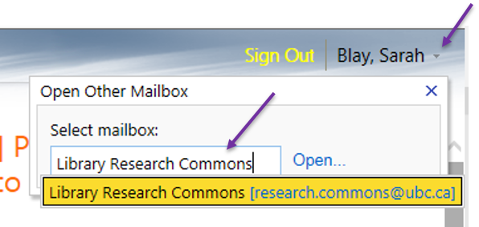

# research.commons@ubc.ca email

## Accessing the Research Commons Email Inbox
1. Go to the <a href="https://www.mail.ubc.ca/owa/research.commons@ubc.ca/" target="blank">UBC online email login</a>.
2. Login with your CWL user name and password.
3. Switch to the **Library Research Commons** mailboxby clicking the down arrow to the right of your name and then entering the text: **Library Research Commons**.

**Note:** If you do not have the option of selecting the Library Research Commons inbox, contact the UBC Library Research Commons Program Coordinator to have this inbox added to your CWL account.

