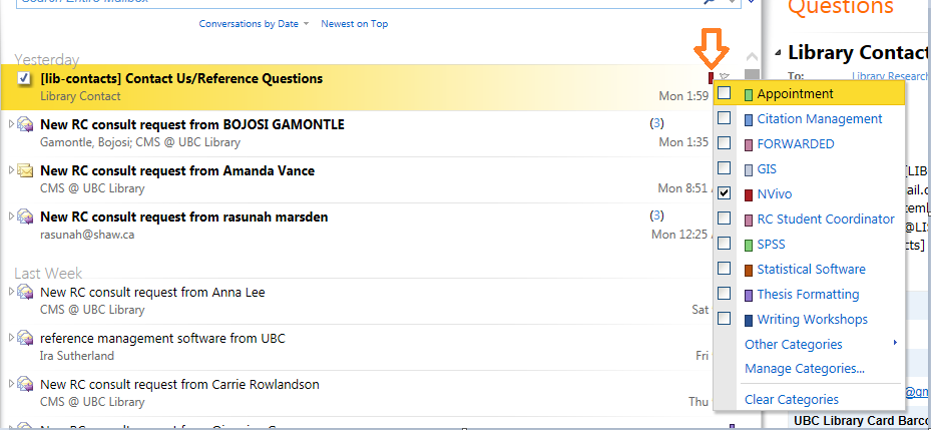

# research.commons@ubc.ca email

## Accessing the Research Commons Email Inbox
1. Go to the <a href="https://www.mail.ubc.ca/owa/research.commons@ubc.ca/" target="blank">UBC online email login</a>.
2. Login with your CWL user name and password.
3. Switch to the **Library Research Commons** mailboxby clicking the down arrow to the right of your name and then entering the text: **Library Research Commons**.

**Note:** If you do not have the option of selecting the Library Research Commons inbox, contact the UBC Library Research Commons Program Coordinator to have this inbox added to your CWL account.

## Working in the Library Research Commons inbox
1. Keep in mind that many people work in this inbox, so following these courtesies helps the whole team.
2. Open the inbox on your shift.
3. Do the following to the emails:
   1. Categorize the emails: 
   2. After categorizing an email that is not in your area, return the email to the state of **UNREAD**.
   3. If you work on an email but have not completed work on it, leave it with the category but marked as READ in the inbox. (ie, part way done). Let anyone else who works in the same subject as you know the status of the email by contacting them directly. For example – I will finish it later – please take a look at it etc.
   4. Move completed emails to the folder for the current year.
