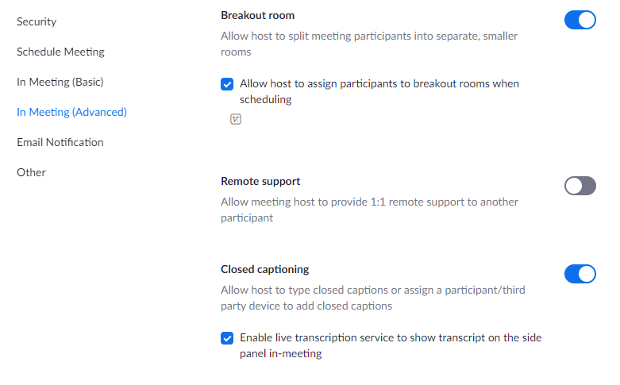

## Do I have to include closed captioning with my workshops?

No but this is a nice way to try to make our workshops more accessible. Additionally, it is very easy to set up and requires very minimal effort on your part once it is set up. Consider speaking slowly and annunciate as much as possible. 

## Free options for captioning at UBC

This information is fortunately quickly evolving, so please email research.commons@ubc.ca if it becomes out-of-date.

### Enable Live Transcription in Zoom

#### Pros

- Free and already included in your UBC Zoom account. 
- Provides closed captioning for all hosts and participants.

#### Cons

- Does not correctly closed caption in all cases. For instance, certain  words can be mis-captioned. Certain accents and voices may be misinterpreted more frequently.

#### To Use

If you don't see the Live Transcriptions option in Zoom when you start your workshop / meeting, go to:

**Settings** > **In Meeting (Advanced)** > **Closed Captioning**. 

Ensure Closed Captioning is enabled and the checkbox is selected, as shown:

### CTLT beta captioning offering

#### Pros

- Is free for anyone with UBC CWL. 

#### Cons

- Only captions the meeting Host.

#### To Use

1. Login with your CWL at: https://zoom-captions.elearning.ubc.ca/

2. Follow the recommended steps described.

   

