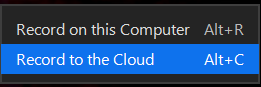
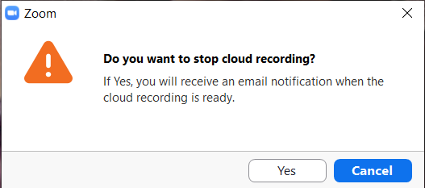
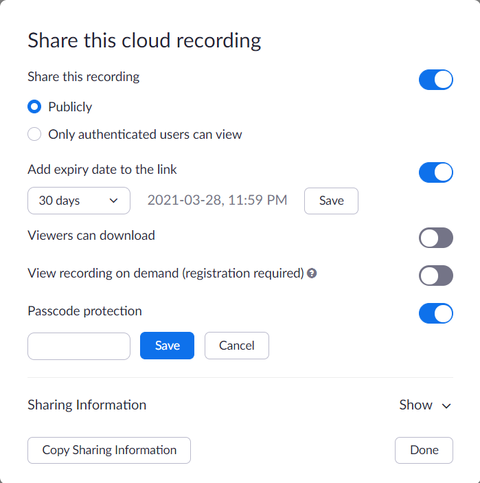

# Do I have to record my workshops?

No. This information is here in case you decide to do so.

# Preparation before recording a workshop

- Make sure that participants know that they are being recorded. 
- Though Zoom will announce that the workshop is being recorded, re-iterate this yourself. 
- Tell participants that they can change their displayed name in the Participants list and turn off their video if they would feel more comfortable.

# What to record

What you record is up to you and your Team Lead to decide. Some folks have acknowledged that recording can stifle group discussions, questions, and how presenters feel about what they are saying also. Some have discovered that just recording the "lecture" part of the workshop can work well so that question and answer periods are less constrained. 

# Where should I store my recording

Store your recording on the Zoom cloud. These servers are located in Canada and comply with UBC's privacy requirements. See https://lthub.ubc.ca/2020/08/23/zoom-cloud-recording-canvas-integration-available/ The recording is saved to the account of the person who created the Zoom link for the workshop. 

## To store your recording to the cloud:

1. Set up your Zoom as you want it to appear on the recording such as Speaker View, Shared Screen etc.
2. In your Zoom workshop, select Record to Cloud
   
   
3. When your workshop is over stop the recording. Click Yes to this message: 
   

# How should I distribute my recording

Typically the Team Lead will be responsible for distributing the recording to participants. This is an advantage to using the Team Lead's account for creating the Zoom. 
1. The person who owns the Zoom account used will receive the email message to let them know that the recording is ready.
2. Login to your Zoom account in a web browser: https://ubc.zoom.us/recording/
3. Find the recording in the list and click Share.
4. Decide on the settings for the recording such as recording expiry and whether a password must be entered to view the recording.!
5. Provide the link sharing information to your Team Lead so that they can share it with your attendees.

# Making recordings available on the RC website

If you decide with your team leads to make recordings permanently available on the RC website, then be sure not to post an expiring link. Please also send an email to research.commons@ubc.ca so that the team is aware of the new recording and can refer new client inquiries as appropriate. In these cases, please do not make a password required to access the link.
