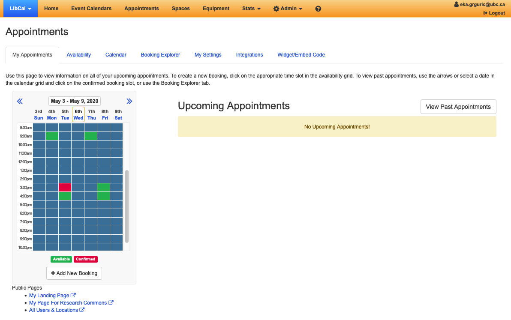
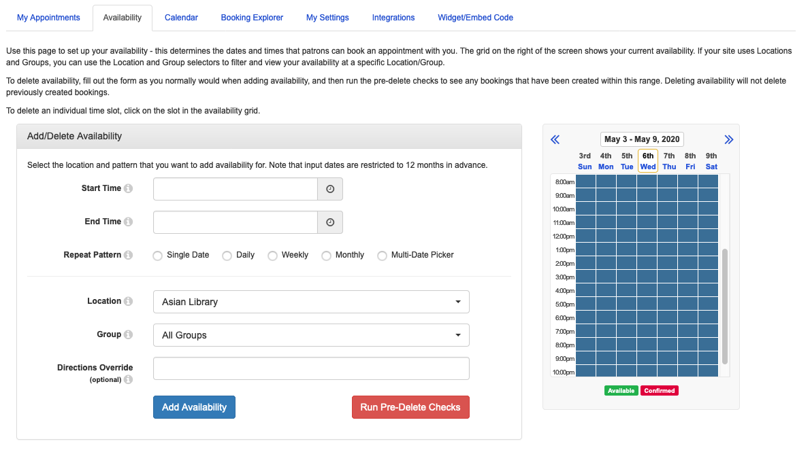
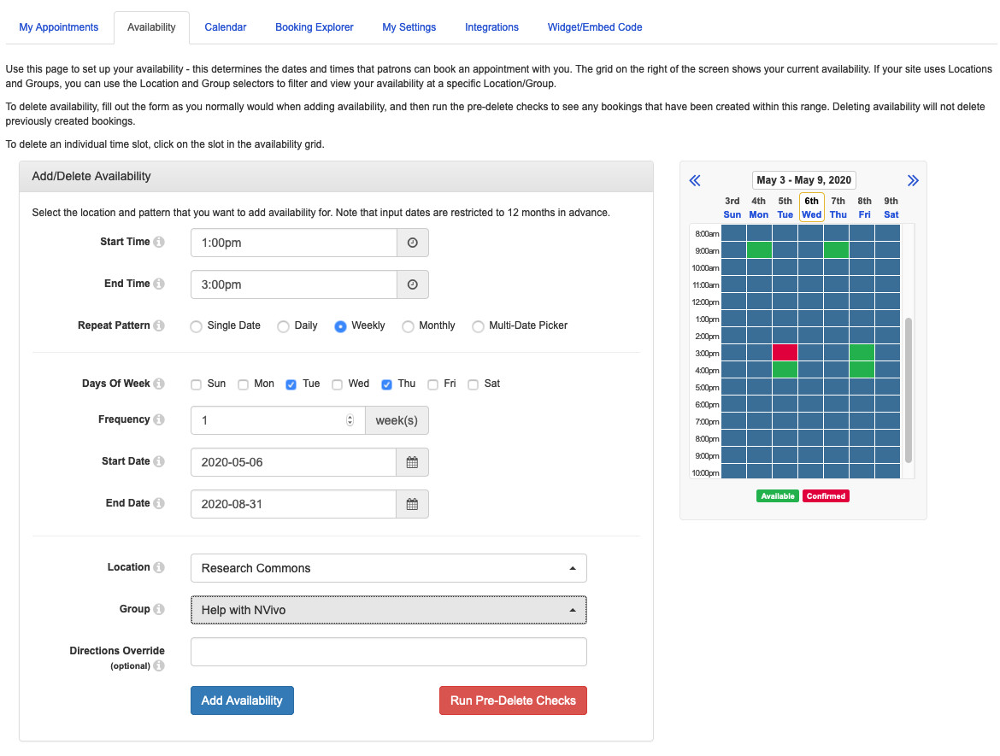
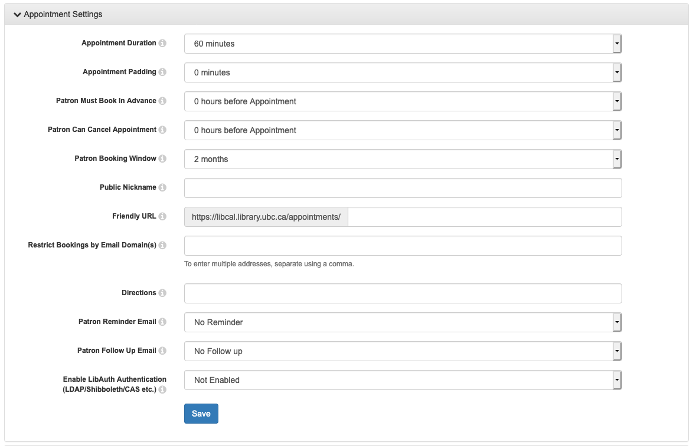
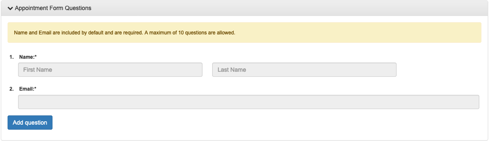
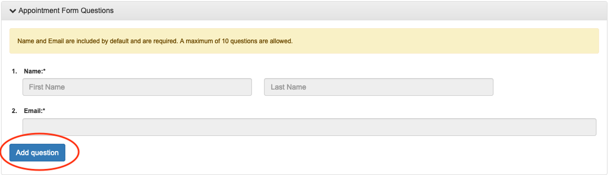
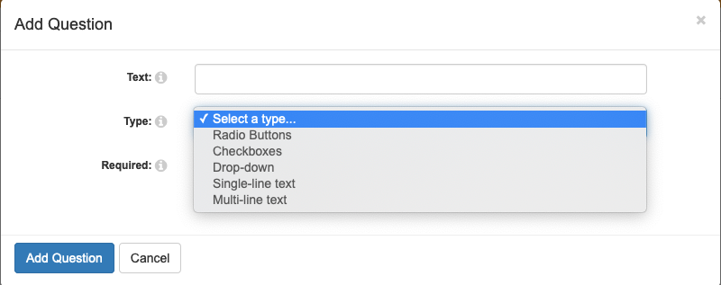
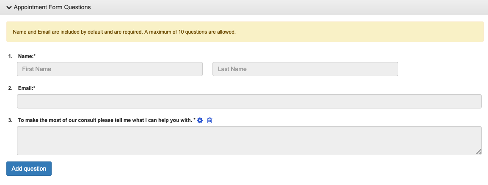
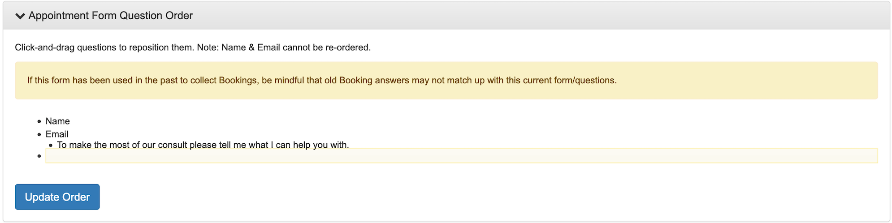

# Setting up consults in LibCal

We use the LibCal appointments module.

1. [Log in to LibCal here](https://library-ubc-ca.libapps.com/libapps/login.php?site_id=9123&target=).

You should see an appointments tab in the main menu:

If you do not see this tab reach out to your team lead or Sarah.

2. The Appointments landing page looks like this:

This is where you can quickly see a list of upcoming appointments, delete appointments, and book additional appointments as necessary.

3. Setting your Availability.

Here is an example of a weekly availability booking from 1:00pm to 3:00pm on Tuesdays and Thursdays for the NVivo team.

Things to keep in mind:
* Location needs to always be set to "Research Commons".
* Always select your group.
* Use "Directions Override" when you need to include additional information for a user. For example, you might want to use this if this specific block of availability is in the Digital Scholarship Lab instead of a Consult Room.
* The default bookable time unit is "60 minutes" with no padding between appointments so setting 1:00pm to 3:00pm means that you are available for 1 60 minute booking. Users can also optionally specify whether they want to book you for a short (30 minutes) or a long consultation (60 minutes) when they book.

# Customising default settings under "My Settings"

Any changes made here are unique to you and don't affect other users of LibCal appointments.

The default appointment settings are:

Consults prioritise members of the UBC community. Under "Enable LibAuth Authentication" select "CWL only" to enforce this. If you have any questions about this policy please discuss it with your team lead.

Zoom links for online consultations are sent to users in the booking confirmation and/or reminder email messages. These must be configured by each GAA (consult your team lead for details).
{: .note}

The default form questions that students who are booking a session are "Name" and "Email":

Each team should connect with their team lead about adding additional questions to the booking form.

4. Setting form fields.

Sometimes it's useful to get additional information from a student or researcher when they are booking you. You can do this by adding questions to the form they fill out in order to request a consult.

In the settings tab page scroll down until you see "Appointment Form Questions" and select "Add Question".

A popup should appear that asks you to input question text, format, and whether it is required.

Once you add a question it will appear sequentially in the "Appointment Form Questions" list.

To reorder questions scroll to the next set of options on the page "Appointment Form Question Order" and drag the question text to the right position in the bulleted list.

Make sure to hit "Update Order" to save your changes.
