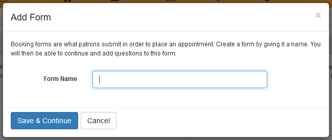
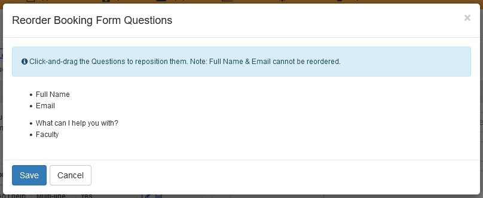

# Setting up consults in LibCal

We use the LibCal Appointments module.

[Log in to LibCal here](https://library-ubc-ca.libapps.com/libapps/login.php?site_id=9123&target=).

You should see an Appointments tab in the main menu:

If you do not see this tab, reach out to your Team Lead or Brett.

The Appointments landing page looks like this:

This is where you can quickly see a list of upcoming appointments, delete appointments, and book additional appointments, as necessary. **NOTE:** You cannot set your availability on this page.

## Setting your availability

Here is an example of a weekly availability booking from 1:00 pm to 3:00 pm on Tuesdays and Thursdays for the NVivo team.

Things to keep in mind:
* Location needs to be set to "Research Commons".
* Always select your Group.
* Use "Directions Override" when you need to include additional information for a user. For example, you might want to use this if this specific block of availability is in the Digital Scholarship Lab instead of a Consult Room.
* The default bookable time unit is "60 minutes" with no padding between appointments. So, setting 1:00 pm to 3:00 pm means you are available for 1 60-minute booking. Users can optionally specify whether they want to book you for a short (30-minute) or a long (60-minute) consultation.

## Customizing default settings under "My Settings"

Any changes made here are unique to you and don't affect other users of LibCal Appointments.

The default appointment settings are:

Consults prioritize members of the UBC community. Under "Activate LibAuth", select "CWL Authentication" to enforce this. If you have any questions about this policy, please discuss it with your Team Lead.

Zoom links for online consultations are sent to users in the booking confirmation and/or reminder email messages. These must be configured by each GAA. Consult your Team Lead for details.

## Customizing booking forms

The default form fields for patrons booking a session are "Name" and "Email".

Sometimes, however, it's useful to get additional information from a student or researcher when they request a consultation. You can do this by adding questions to the form they fill out. **NOTE:** Before adding additional questions, team members should connect with their Team Lead.

On the top of the Appointments page, select the "Booking Forms" tab.

Scroll down to the "Forms" box, and click the "Add New Form" button.

In the popup window, enter a name for the form, and click "Save & Continue".

Click the "Add New Question" button, and enter the question, its type, and whether it is required. Click "Save".

Once you add a question, it will appear sequentially in the left "Questions" column.

To reorder multiple questions, click the "Reorder Questions" button at the bottom of the "Questions" box. In the pop-up window, drag the question text to the desired position in the bulleted list. Make sure to save your changes.

To set this form as your default for all consultations, on the "Booking Forms" page, click the "Override my Booking Form" button, and select "All Bookings (User Default)".

In the pop-up window, select your form in the "Booking Form" field, and save.

