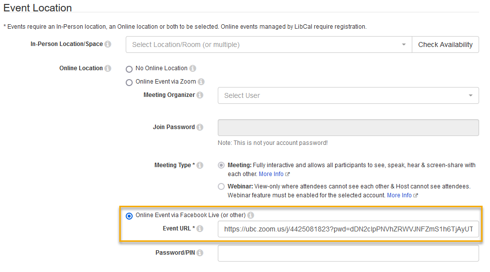
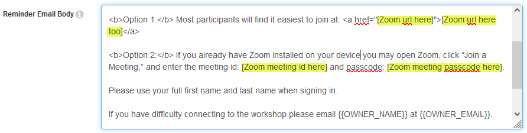
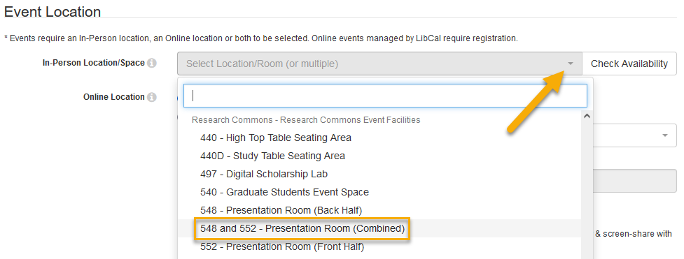
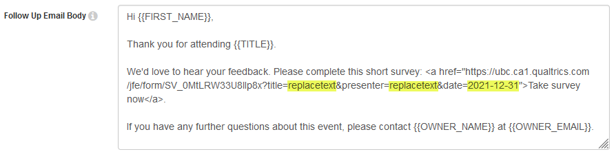

There are two workflows to creating an event in LibCal in the Research Commons. These are determined by the event's location (online or in person).  

## Steps shared by both workflows
1. From the LibCal homepage, click **Events** in the top menu bar.
2. Within the **Modify/View Calendar** field, click **UBC Vancouver Libary Public Events**.
3. Click the **+Add New Event** button on the left-hand side of the screen, or double-click the calendar on the date for which you would like to create the event.  

## Creating online events
4. From the drop-down menu, select the **Research Commons Events - ONLINE** template, then click **Continue**.
5. Enter values for the following fields: **Date**, **Start Time**, **End Time**, **Event Title**, **Event Description**.
6. Under the **Event Location** section, click the **Online Event via Facebook Live (or other)** radio button, and copy and paste the Zoom link for the event in the **Event URL** box.  

7. In the **Reminder Email Body** box, enter the event's Zoom link in the *two* pre-designated locations, along with the Zoom Meeting ID and Passcode.  

## Creating in-person events
4. From the drop-down menu, select the **Research Commons Events - IN PERSON** template, then click **Continue**.
5. Enter values for the following fields: **Date**, **Start Time**, **End Time**, **Event Title**, **Event Description**.
6. Under the **Event Location** section, click the **In-Person Location/Space** drop-down menu, scroll down to the Research Commons, and select your desired space.   
  
7. Click the **Check Availability** button to the right to verify the space has not already been booked.

## Steps shared by both workflows
8. You will need to update the unique survey link, located within the **Follow Up Email Body** box. This will allow us to distinguish your survey results from those of other events. The image below shows you the parts you must change to match the details of your event.  

9. Scroll to the bottom of the page and click the **Submit: Add New Event!** button.
