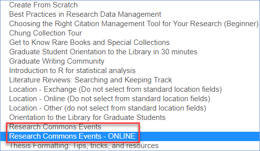
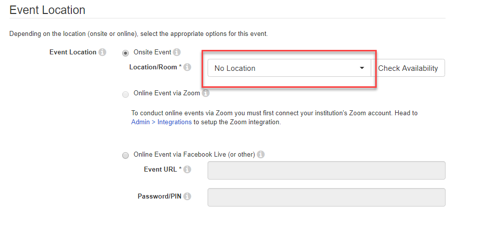
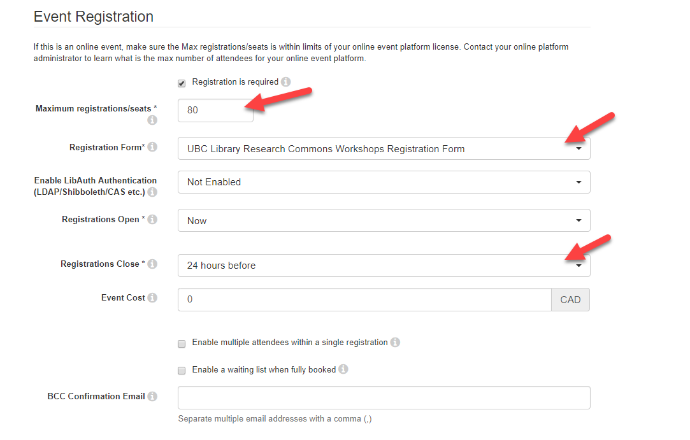
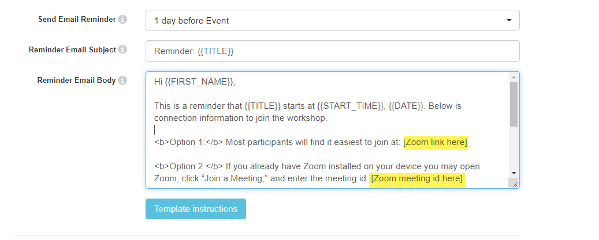
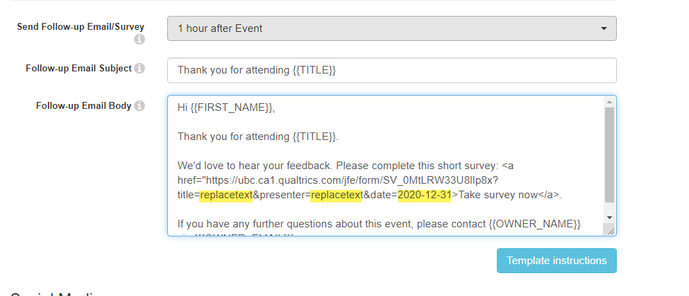

[//]: # does this work or show up.

# Booking online workshops in LibCal
1. If you are on the Research Commons team or want members of the Research Commons team to have access to help you with your event in LibCal, login to LibCal with research.commons@ubc.ca. If you want to manage the event on your own you can login using your UBC CWL.
All of the Research Commons team should use the research.commons@ubc.ca login to facilitate collaboration.
{: .note}
2. Choose Research Commons Events ONLINE (if your workshop is in a physical room, choose Research Commons Events) template in LibCal.

3. You need select No Location under Event Location. (Note this is temporary solution until the new functionality for Zoom is set up.)

4. For Event Registration, with the Research Commons Events ONLINE template, the default is 80 people with no waiting list. Also, the registration form is automatically selected so that participants can enter their unit and whether they would like to receive our newsletter.

5.  Now you need to enter your Zoom link in two spots in the Reminder Email section.

6. You need to update the unique survey link. You start with the base link of <a href="https://ubc.ca1.qualtrics.com/jfe/form/SV_0MtLRW33U8lIp8x?title=replacetext&presenter=replacetext&date=2020-12-31" target="_blank">https://ubc.ca1.qualtrics.com/jfe/form/SV_0MtLRW33U8lIp8x?title=replacetext&presenter=replacetext&date=2020-12-31</a> but you must make a unique link for your workshop so we can distinguish your survey results from other workshops.  The image below shows you the part you must change to match the details of your workshop. 

