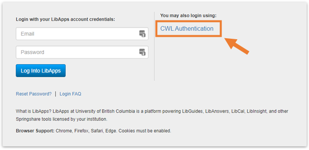

Recording activities in LibInsight
============================

UBC Library uses LibInsight software to record information about patron questions (including scheduled consultations) and group presentations. Records are compiled for annual statistical surveys and may be used by branches/units in planning and assessment.

**GAA's are responsible** for entering data about their consultations and workshops.

## Login and data entry
There are two ways to open LibInsight datasets for data entry. Both methods require login. At the login page click the CWL Authentication link and enter your credentials when prompted.

### Option 1: open dataset with a shortcut URL
Below are URLs to the datasets frequently used by Koerner Library employees. These may be bookmarked for quick access.

| dataset | shortcut URL
| --- | ---
| Patron questions - Koerner Library | https://libraryubc.libinsight.com/koerner-library  
| Group presentations - All | https://libraryubc.libinsight.com/group-presentations 

You may be prompted to login if you haven't recently. After login, re-load the URL to open the dataset.
{: .warn}

### Option 2: open dataset from LibInsight interface

- visit <http://libraryubc.libinsight.com/>
- Click *CWL authentication* and enter your credentials when prompted
- On the LibInsight landing page select the desired dataset from the *Record data to* drop-down menu:
	- Patron questions - Koerner Library
	- Group presentations - All

## Data entry notes

### Patron questions dataset
Use the _Patron questions_ dataset to record information about your consultations. Do not record no-shows.

-   **Desk**. Employee group of person entering the data.
-   **Contact method**. Refers to the actual consultation. Use _Walk in_ for in-person consultations.
-   **Question type**. For consultations select one of the *Reference* options.
-   **Time (minutes)**. This can be an estimate.
-   **What is the question? Comments?**. A short phrase or two is enough. The purpose is to provide a broad overview of the type of questions, projects and topics we supported.
-   **Team (students only)**. The RC team you belong to.

### Group presentations dataset 
Use the _Group presentations_ dataset to record information about your workshops. Only the _required_ fields need to be completed. Each workshop should be entered only once (if co-presenting, agree on who will enter the data).

-   **Library branch/unit**. Select *Koerner Library* 
