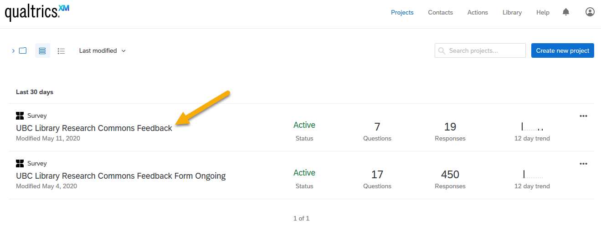
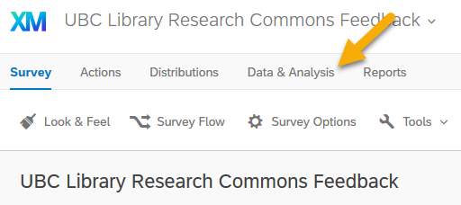
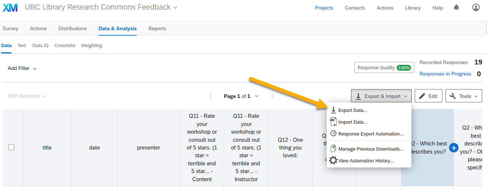
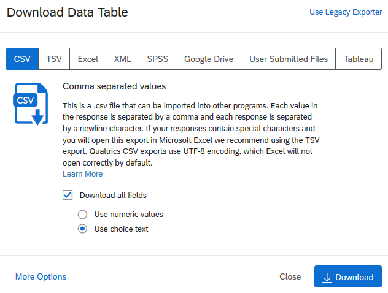
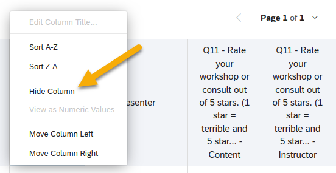
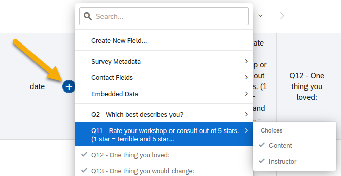
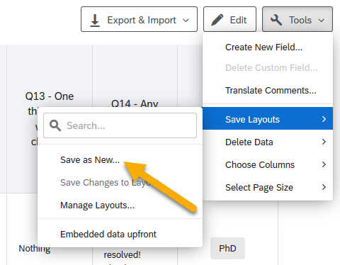
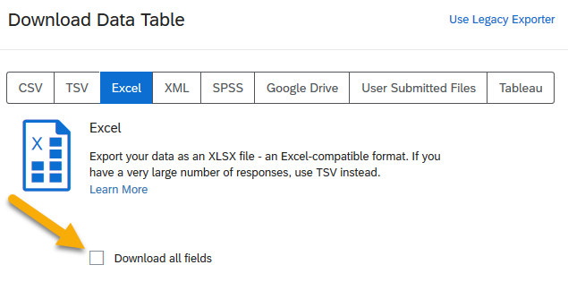

# How to download Qualtrics data
1. Log in to Qualtrics (https://ubc.qualtrics.com/).
2. Select the correct survey (UBC Library Research Commons Feedback).
  
  
  
3. Select "Data and Analysis" in the top-left corner of the screen.

4. Select "Export & Import", then "Export Data...".

## Downloading all the data contained within a survey
5. On the Download Data Table pop-up screen, choose the file type you would like to select (e.g. Excel, CSV), and click the "Download" button in the bottom-left corner. Leave the default options ("Download all fields" and "Use choice text") selected.

## Downloading pre-filtered data only
Qualtrics provides the option of exporting only specified data. To do this, you will need to format the data page to reflect the data you would like to include/exclude.

<b>To hide a column:</b> Click on the column header. Select "Hide Column".

<b>To insert a column in a specific location:</b> Hover over a column header adjacent to where you'd like to insert the new column. Click on the "+" sign that appears on the side where you'd like to insert the new column. Select the name of the data you'd like to insert.

<b>To save a layout:</b> Click "Tools" on the right-hand side of the screen, then "Save Layouts", and finally "Save as New...".

Once you have the data in the format you'd like for exporting, select "Export & Import", then "Export Data...". Choose your preferred file type. <b>Unselect the "Download all fields" button</b>, and click "Download".

