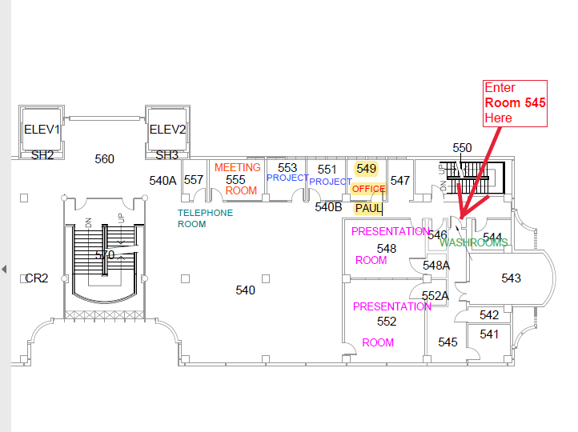
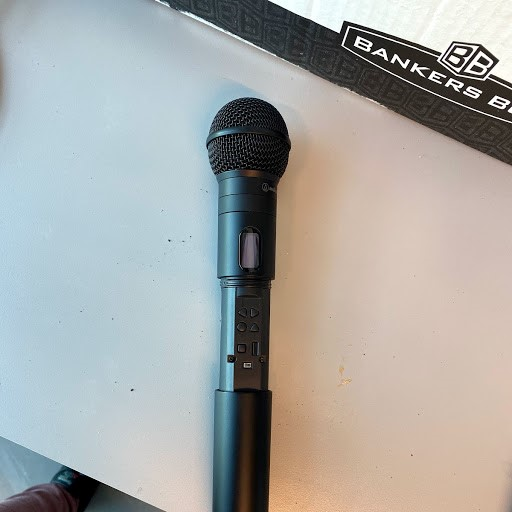
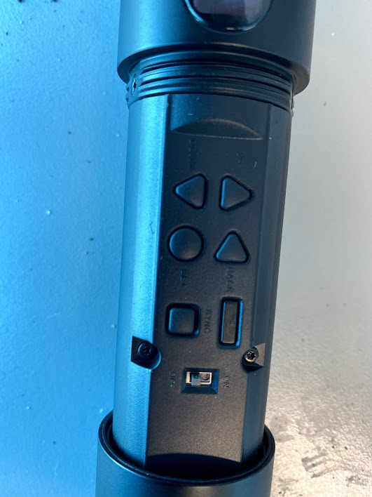
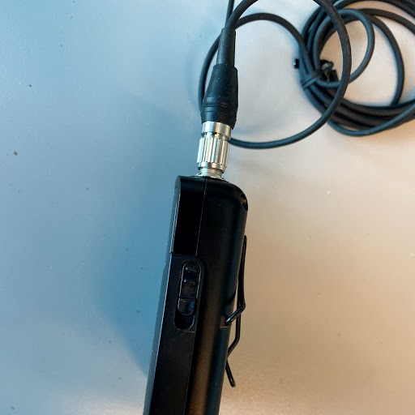
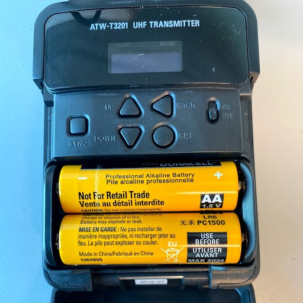
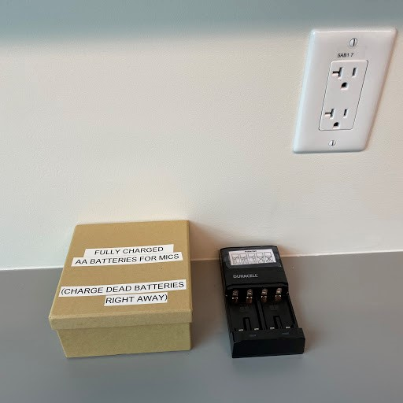

# Presentation Room (Room 548 and 552) Use
[Using the Microphones](#using-the-microphones)
# Projecting video onto screens

**DO NOT** rely on Air Media for presentations. It will only work temporarily and then fail in the middle of your presentation / workshop.

**Instead, use the HDMI and VGA connectors.** 
The best and easiest option is to connect directly to the HDMI or VGA cables in the room. 

## Adaptors for projecting video
We have connectors for all flavours of MAC and PC laptops and tablets if you do not have a direct HDMI or VGA port on your laptop.

  
### Where can I find the adapters?
They are in the marked cupboard in Room 545 in Koerner Library:
 

# Using the UBC Library Research Commons laptops
The UBC Library Research Commons laptops are intended for the use by instructors and students in UBC Library Research Commons workshops. There are two PCs and one MAC. Unfortunately the current setup is such that you must login in advance of the workshop and this process can take quite a bit of time. For this reason, the instructor (GAA, Librarian, etc.) leading the class needs to login to the machine on behalf of the student.

## Laptops located in cupboards in Room 545

# Using the Microphones
For both the handheld and lapel mics, you need to find the secret ON button to make them work.

## Where are the microphones stored?
Both microphones for the Presentation Room are stored in the cupboard in Room 545. All UBC Library Research Commons employees have access to this room. Note that microphone (lapel) for the Digital Scholarship Lab is stored in the Map Printer Room beside the Digital Scholarship Lab. It is in a marked cupboard which is locked. All UBC Library Research Commons employees also have access to this room and a key for that cupboard.

## Accessing ON button for handheld mic:
1. Twist the body of the mic to the left to loosen. Once loose, pull the handle shell down to reveal the buttons. 

2. The ON/OFF button is the tiny grey button closest to the bottom of the controls.

## Accessing ON button for lapel mic:
1. Unlatch the release buttons on both sides of the unit simultaneously to release the front door. The image shows the release button on one side.

2. Once the front door is opened, the ON/OFF button will be revealed. It is the tiny black button on the far right side of the controls.

## When batteries die for mics:
1. There are backup batteries in the cupboard in the Map Printer Room (497A) and in Staff Room 545. The battery charger is in Room 545. Grab the batteries right away when you need them.
2. Make sure to charge dead batteries right away. 
3. Only put charged batteries back in the basket in Room 497A and the cardboard box in Room 545. This will keep the flow of live batteries alive!! 

