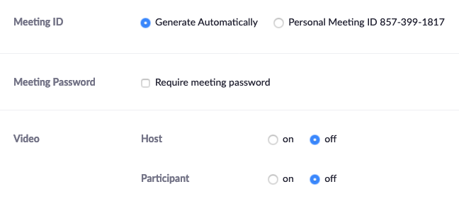
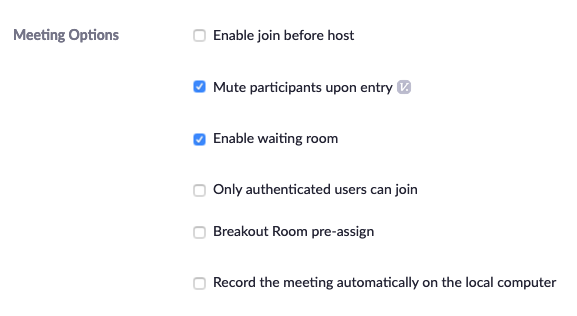
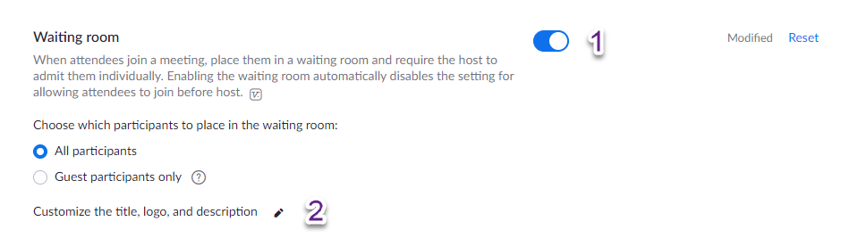
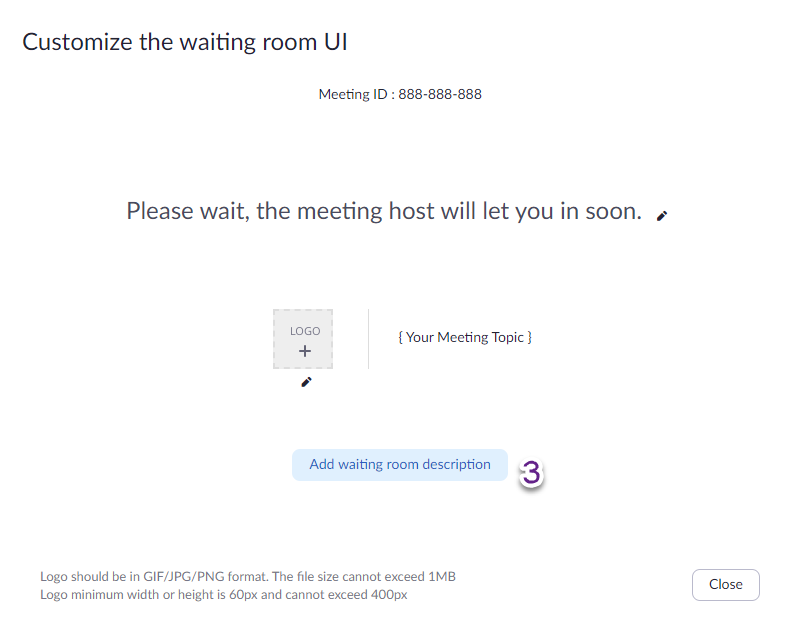
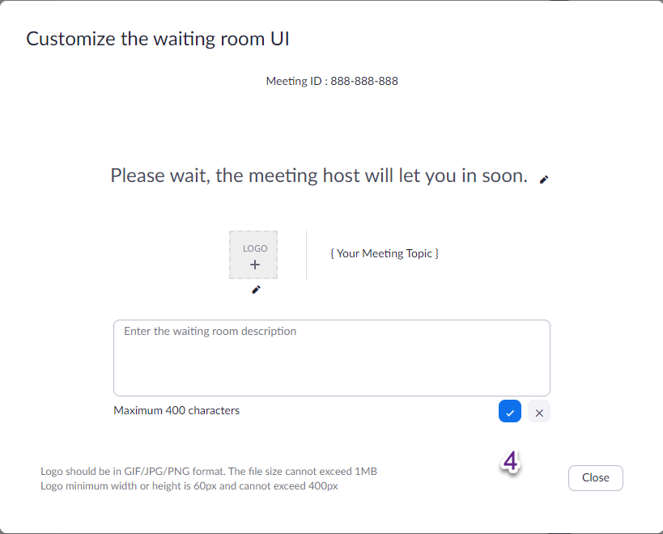
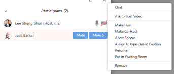

# Getting a UBC Education Zoom account
1. You will need a UBC Zoom account to lead workshops so that your workshop length is unlimited and you can lead up to 300 participants. Go to this link:
<a href="https://ubc.service-now.com/selfservice?id=sc_cat_item&sys_id=cc7f5fb9874e0100bbee70406d434df9" target="_blank">https://ubc.service-now.com/selfservice?id=sc_cat_item&sys_id=cc7f5fb9874e0100bbee70406d434df9</a>.     

Note: You will be prompted for your CWL and password.    

The Zoom account will be setup within about 2 business days. If you are waiting longer than this, please contact [research.commons@ubc.ca](mailto:research.commons@ubc.ca) email for follow up.    

# Recommended Zoom settings
1. Make sure you have the following settings:
  * Meeting ID > Generate Automatically
  * Video Host and Video Participant set to off.
    
1. Also, make sure both of these are on:
  * Mute participants upon entry
  * Enable waiting room
     
1. Enable the Waiting Room and also do a bug work around so that the Waiting Room messaging looks correct following these steps.
  * In your Zoom settings (<a href="https://zoom.us/profile/setting" target="_blank">https://zoom.us/profile/setting</a>), enable Waiting Room. 

  * Now the pencil icon to the right of Customize the title, logo, and description.
  * Now click on Add waiting room description (even though you won't actually be adding a description).

  * Now click the check box and then Close the dialog.
  

# Recording your sessions / Privacy issues
  * Please do not record your sessions due to privacy concerns.
  * If your team (including your Team Lead) decides you should record a session, the co-host must announce at the beginning of the session that it is being recorded. 
  * Also, a note needs to be added in the meeting reminder to let participants know it will be recorded with the suggestion that participants only login with their first names. In the middle of a workshop, change your display name by clicking your name in the Participants list and selecting Rename.
  
  

# Roles and responsibilities
In the teaching pair, or teaching group, you need to first figure out who will be Host and who will be Co-host. 

## Host responsibilities (Monitoring chat and keeping workshop running smoothly)
Before workshop:
1. Set up the Zoom link for your workshop:
   1. Two weeks before your workshop, generate a Zoom link for your workshop at <a href="https://zoom.us/meeting" target="_blank">https://zoom.us/meeting</a>. Check with your Team Lead (Allan Cho, Eka Grguric, Jeremy Buhler, Evan Thornberry) to confirm the date and time. 
   2. Once created, send the Zoom link to your Team Lead so they can put it into the event for your participants.
2. Read through everything you need to do during the workshop and make sure you will be ready to handle these items.
During workshop:
3. Add attendees from the waitroom into the main session.
4. Post links in the chat window that your co-host mentions. (This includes where your workshop materials are online and the feedback survey at the end of the workshop.)
5. Take screenshots of the participant pane at approximately the 15 minute mark for attendance. 
6. Monitor the chat and participant pane for raised hands and other commentary.
7. Download screenshots of the whiteboards throughout the session if you use this feature.
After workshop:
8. Export the chat for the reference of your co-host and yourself and also in case you did not get to all of the questions.
9. Enter your attendance numbers in Desktracker.

## Co-host responsibilities (Presenter)
Before workshop:
1. Orient yourself to the Zoom features so you can seamlessly explain them to your attendees. If this is your first Zoom workshop, work with your teaching partner to actually try the features before the workshop.  
   1. For a quick overview, see <a href="https://ubc-library-rc.github.io/intro-api/online.html" target="_blank">https://ubc-library-rc.github.io/intro-api/online.html</a>. 
   2. See the Zoom guide for UBC students here:  <a href="https://keepteaching.ubc.ca/files/2020/04/zoom-student-guide.pdf" target="_blank">https://keepteaching.ubc.ca/files/2020/04/zoom-student-guide.pdf</a>    
   
During the workshop:
2. You are presenting / teaching the workshop / webinar content. 
3. Welcome attendees.
4. Orient attendees to location of webinar website, slides, and other materials.
5. Orient attendees to Zoom features and let the students know they can enter questions in the chat that your partner will answer while you are presenting.    

After workshop:
6. Touch base with your teaching partner to debrief what worked, what didn't, areas to improve etc.

## Others Responsibilities
1. Allan Cho, Eka Grguric, Jeremy Buhler, Evan Thornberry will put the GAA's zoom link into the reminder email for the event.
2. Sarah Blay and Brett Dimond will be online for all workshop times in case emails come through [research.commons@ubc.ca](mailto:research.commons@ubc.ca).

# Breakout rooms (Optional)
Breakout rooms can be used in a variety of scenarios such as when some users are on MACs and others PCs (and the workflows are different) or if you need to give help to a certain individual while the workshop continues.
1. Before using Breakout rooms in Zoom, it is recommended that you try this feature with your teaching partner to practice for smooth running in your actual workshop.
2. Learn about Breakout room use here: <a href="https://support.zoom.us/hc/en-us/articles/206476093-Enabling-breakout-rooms" target="_blank">https://support.zoom.us/hc/en-us/articles/206476093-Enabling-breakout-rooms</a>.

